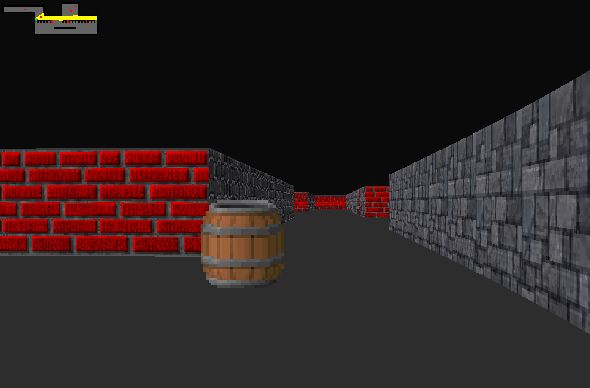

# cub3d
_Subject [here](../subjects/cub3d.subject.pdf)_

 
    

    

### Introduction
The aim of this project is to make you code a function that returns a line
ending with a newline, read from a file descriptor.
This project will not only allow you to add a very convenient function to your collection,
but it will also allow you to learn a highly interesting new concept in C programming:
static variables.

### How do I use it?
1. Clone this repo and cd into it:
